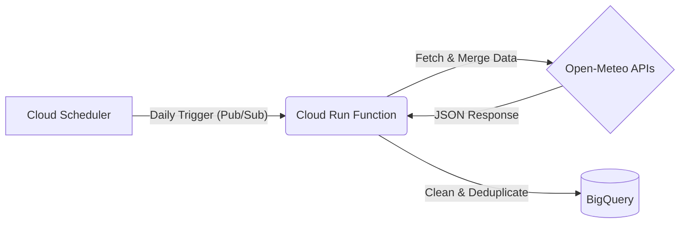

# ☁️ Delhi Air Quality Data Pipeline (GCP)


A robust, serverless ETL pipeline that automatically fetches, cleans, and stores daily Air Quality (PM2.5) and Weather data for Delhi, India. Built on Google Cloud Platform using Cloud Run Functions, BigQuery, and Cloud Scheduler.

---


## 🎯 Project Goals
* **Primary Goal:** To learn and build a Serverless ETL pipeline in Google Cloud Platform (GCP).
* **Secondary Goal:** To aggregate historical Delhi PM2.5 data for multivariate Time-Series Forecasting using [MLforecast](https://nixtlaverse.nixtla.io/mlforecast/index.html) library

---

## 🏗️ Architecture

The pipeline runs entirely on Google Cloud's **Free Tier** and follows a fully serverless event-driven architecture.


---

1. Trigger: Cloud Scheduler publishes a message to a Pub/Sub topic every day at 9:00 AM.

2. Extract: The Cloud Run Function (Python) wakes up and queries BigQuery to find the last_updated_date.

3. Backfill Logic: It calculates the date range from last_updated_date + 1 to yesterday. If data exists, it fetches only the missing days.

4. Transform:

   - Fetches PM2.5 from the Air Quality API.

   - Fetches Temperature, Humidity, and Wind from the Weather Archive API.

   - Merges the datasets on timestamp.

   - Aggregates hourly data into Daily Averages.

5. Load: Appends the clean data to a Partitioned BigQuery Table.
---

## 🛠️ Tech Stack
- Language: Python 3.12

- Libraries: pandas, pandas-gbq, requests, functions-framework

- Cloud Services:

   - Cloud Run Functions (Gen 2): For serverless execution.

   - BigQuery: For data warehousing (Partitioned by Day).

   - Cloud Scheduler: For cron-job automation.

   - IAM: For secure, keyless authentication between services.
 
---

## 🚀 Key Features
### 1. Idempotency & Smart Backfilling
The script is designed to never duplicate data. Before fetching from the API, it runs a SQL query:
```sql
SELECT MAX(timestamp) FROM `weather_data.bangalore_daily`;
```
- If the script crashes for 5 days, the next run automatically detects the gap and fetches **all 5 missing days**.

- If the script runs twice in one day, the second run detects that data is up-to-date and exits immediately.

### 2. Dual-Source Data Merging
Because Air Quality (PM2.5) and Weather (Wind/Temp) come from different API endpoints, the pipeline performs an in-memory join using Pandas to create a unified dataset before upload.

### 3. BigQuery Optimization
The target table is Partitioned by Date. In the event the table size increases beyond expectations, partioning the data will reduce the query time.

---

## 📊 Data Schema
The data is stored in `weather_data.bangalore_daily`:

| Column Name | Data Type | Description
|:------------:|:----------:|:---------------:|
timestamp| TIMESTAMP| The date of observation (Partition Key)
PM2_5| FLOAT| Daily Average Particulate Matter < 2.5µm
Temperature| FLOAT| Daily Average Temperature (°C)
Humidity| FLOAT| Relative Humidity (%)
Wind_Speed| FLOAT| Wind Speed (km/h)
Wind_Direction| FLOAT| Wind Direction (Degrees)

